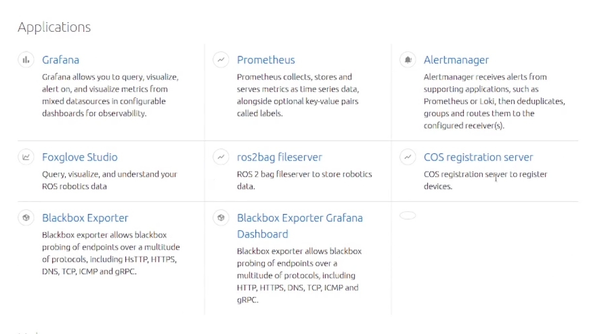
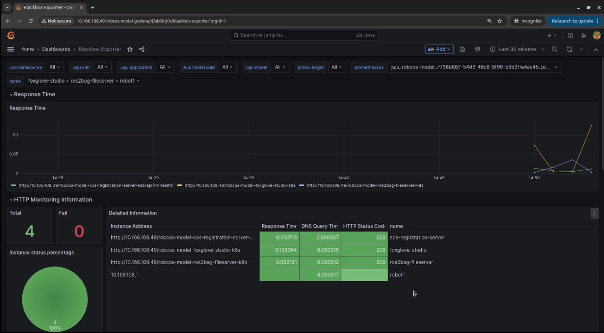

# rob-cos-overlay

The rob-cos overlay is an overlay bundle for [cos-lite](https://github.com/canonical/cos-lite-bundle/tree/main).
The robotics overlay customises the upstream COS lite bundle to observe robotics devices.

## Deploy rob-cos-overlay with Blakcbox Exporter Dashboard

This branch deploys rob-cos-overlay with integration to the [Blackbox Exporter charm](https://github.com/canonical/blackbox-exporter-k8s-operator).

This charm allows for monitoring of the devices registered to the robotics observability stack and the robotics charms (cos-registration-server, ros2bag-fileserver and foxglove-studio).

### Pack the charms

Currently the charms integrated with blackbox must be first packed locally, and then deployed with the overlay.

- Pack the blackbox-exporter charm with:

```sh
git clone -b feat/catalogue-grafana-dashboard https://github.com/ubuntu-robotics/blackbox-exporter-k8s-operator.git
cd blackbox-exporter-k8s-operator && charmcraft pack
```

- Pack the cos-registration-server charm with:

```sh
git clone -b feat/integrate-with-blackbox https://github.com/ubuntu-robotics/cos-registration-server-k8s-operator.git
cd cos-registration-server-k8s-operator && charmcraft pack
```

- Pack the foxglove-studio charm with:

```sh
git clone -b ffeat/integrate-with-blackbox https://github.com/ubuntu-robotics/foxglove-k8s-operator.git
cd foxglove-k8s-operator && charmcraft pack
```

- Pack the ros2bag-fileserver charm with:

```sh
git clone -b feat/integrate-with-blackbox https://github.com/ubuntu-robotics/ros2bag-fileserver-k8s-operator.git
cd ros2bag-fileserver-k8s-operator && charmcraft pack
```

### Deploy

Clone the source repository:

```sh
git clone -b feat/add-blackbox https://github.com/ubuntu-robotics/rob-cos-overlay.git
```

The local charms must be in the same folder where the overlay is being deployed.
Move the previously packed charms in the rob-cos-overlay folder and then deploy as follows:

```sh
juju deploy cos-lite --trust --overlay ./robotics-overlay.yaml
```

Once deployed the catalogue should look as follows:

<div align="center">
	
</div>

By clicking on the Blackbox Exporter Grafana Dashboard the monitoring dashboard will look as follows:

<div align="center">
	
</div>
